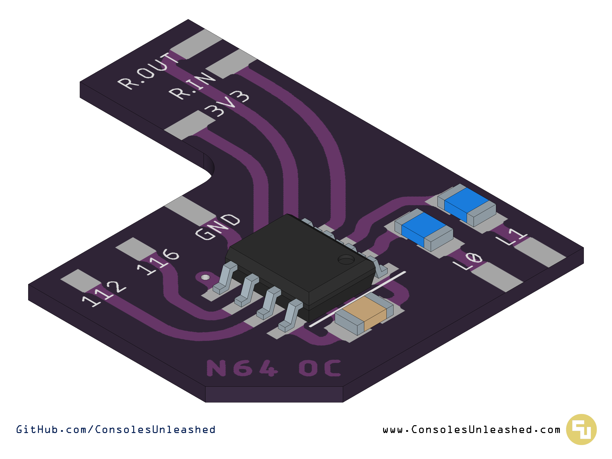

# Nintendo 64 Switchless Overclock PCB

A small PCB design to be used with Borti4938's switchless overclock code for Nintendo 64.

## Version History

### Basic

- v1.0 - 11/01/2025 - Incorrect measurements. Unusable.
- v1.1 - 24/01/2025 - PCB is good, although it still says v1 on the underside.

### With LED

- v1.0 - Coming soon.

## Future Work

Add a protrusion for an LED mount. Coming very soon.

## Licence

If you use this in any way, shape or form, you must include a link back to this repository and mention me by name on any sales pages and social media posts. Not only will this help me to keep designing mod kits and offering them to the community, but it is basic common courtesy as well. Don't be a douchebag. :)

Also this 'GNU GENERAL PUBLIC LICENSE Version 2, June 1991'.
